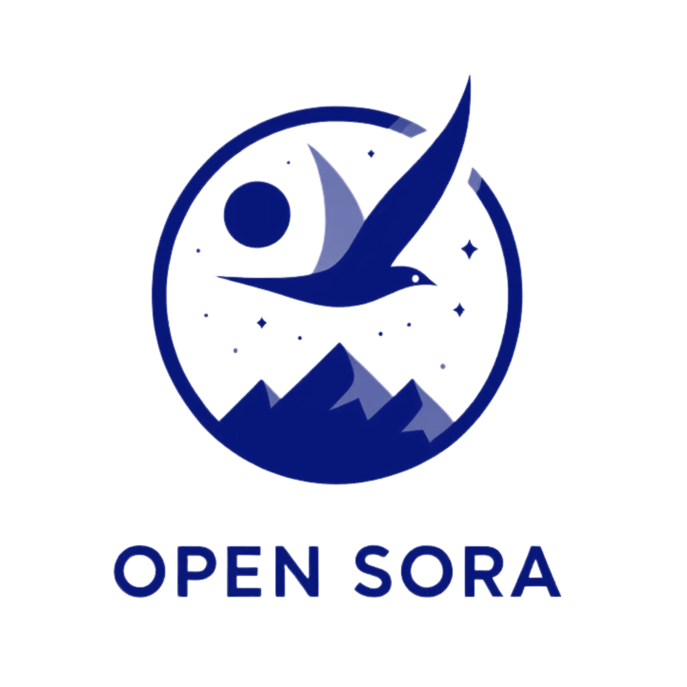

<p align="center">
    
</p>
<div align="center">
    <a href="https://github.com/hpcaitech/Open-Sora/stargazers"></a>
    <a href="https://hpcaitech.github.io/Open-Sora/"></a>
    <a href="https://discord.gg/kZakZzrSUT"></a>
    <a href="https://join.slack.com/t/colossalaiworkspace/shared_invite/zt-247ipg9fk-KRRYmUl~u2ll2637WRURVA"></a>
    <a href="https://twitter.com/yangyou1991/status/1769411544083996787?s=61&t=jT0Dsx2d-MS5vS9rNM5e5g"></a>
    <a href="https://raw.githubusercontent.com/hpcaitech/public_assets/main/colossalai/img/WeChat.png"></a>
    <a href="https://hpc-ai.com/blog/open-sora-v1.0"></a>
    <a href="https://huggingface.co/spaces/hpcai-tech/open-sora"></a>
</div>

## Open-Sora: Democratizing Efficient Video Production for All

We design and implement **Open-Sora**, an initiative dedicated to **efficiently** producing high-quality video. We hope to make the model,
tools and all details accessible to all. By embracing **open-source** principles,
Open-Sora not only democratizes access to advanced video generation techniques, but also offers a
streamlined and user-friendly platform that simplifies the complexities of video generation.
With Open-Sora, our goal is to foster innovation, creativity, and inclusivity within the field of content creation.

[[中文文档](/docs/zh_CN/README.md)] [[潞晨云](https://cloud.luchentech.com/)|[OpenSora镜像](https://cloud.luchentech.com/doc/docs/image/open-sora/)|[视频教程](https://www.bilibili.com/video/BV1ow4m1e7PX/?vd_source=c6b752764cd36ff0e535a768e35d98d2)]

## Inference with Separated text encoder

We separate the text encoder to reduce the memory usage.
To inference the watemarked fine-tuned model, you can execute inference_watermarked.sh as follows:

```bash
# inference
. ./ inference_Watermarked.sh
```

## Fine tune watermark model 'Stable Signature'

To fine-tune stable signature model, you can execute stable_signature_finetune.sh as follows:

```bash
# fine tune
. ./ stable_signature_finetune.sh
```

## Metrics

To evaluate image quality and bit accuracy, you can execute metrics_stable_signature.sh as follows:

```bash
# fine tune
. ./ metrics_stable_signature.sh
```


## Installation

### Install from Source

For CUDA 12.1, you can install the dependencies with the following commands. Otherwise, please refer to [Installation Documentation](docs/installation.md) for more instructions on different cuda version, and additional dependency for data preprocessing, VAE, and model evaluation.

```bash
# create a virtual env and activate (conda as an example)
conda create -n opensora python=3.9
conda activate opensora

# download the repo
git clone https://github.com/hpcaitech/Open-Sora
cd Open-Sora

# install torch, torchvision and xformers
pip install -r requirements/requirements-cu121.txt

# the default installation is for inference only
pip install -v . # for development mode, `pip install -v -e .`
```

(Optional, recommended for fast speed, especially for training) To enable `layernorm_kernel` and `flash_attn`, you need to install `apex` and `flash-attn` with the following commands.

```bash
# install flash attention
# set enable_flash_attn=False in config to disable flash attention
pip install packaging ninja
pip install flash-attn --no-build-isolation

# install apex
# set enable_layernorm_kernel=False in config to disable apex
pip install -v --disable-pip-version-check --no-cache-dir --no-build-isolation --config-settings "--build-option=--cpp_ext" --config-settings "--build-option=--cuda_ext" git+https://github.com/NVIDIA/apex.git
```

### Use Docker

Run the following command to build a docker image from Dockerfile provided.

```bash
docker build -t opensora .
```

Run the following command to start the docker container in interactive mode.

```bash
docker run -ti --gpus all -v .:/workspace/Open-Sora opensora
```

## Model Weights

### Open-Sora 1.2 Model Weights

| Model     | Model Size | Data | #iterations | Batch Size | URL                                                           |
| --------- | ---------- | ---- | ----------- | ---------- | ------------------------------------------------------------- |
| Diffusion | 1.1B       | 30M  | 70k         | Dynamic    | [:link:](https://huggingface.co/hpcai-tech/OpenSora-STDiT-v3) |
| VAE       | 384M       | 3M   | 1M          | 8          | [:link:](https://huggingface.co/hpcai-tech/OpenSora-VAE-v1.2) |

See our **[report 1.2](docs/report_03.md)** for more infomation. Weight will be automatically downloaded when you run the inference script.

> For users from mainland China, try `export HF_ENDPOINT=https://hf-mirror.com` to successfully download the weights.


## Inference

### Open-Sora 1.2 Command Line Inference

The basic command line inference is as follows:

```bash
# text to video
python scripts/inference.py configs/opensora-v1-2/inference/sample.py \
  --num-frames 4s --resolution 720p --aspect-ratio 9:16 \
  --prompt "a beautiful waterfall"
```

You can add more options to the command line to customize the generation.

```bash
python scripts/inference.py configs/opensora-v1-2/inference/sample.py \
  --num-frames 4s --resolution 720p --aspect-ratio 9:16 \
  --num-sampling-steps 30 --flow 5 --aes 6.5 \
  --prompt "a beautiful waterfall"
```

For image to video generation and other functionalities, the API is compatible with Open-Sora 1.1. See [here](docs/commands.md) for more instructions.

If your installation do not contain `apex` and `flash-attn`, you need to disable them in the config file, or via the folowing command.

```bash
python scripts/inference.py configs/opensora-v1-2/inference/sample.py \
  --num-frames 4s --resolution 720p \
  --layernorm-kernel False --flash-attn False \
  --prompt "a beautiful waterfall"
```


## Training

### Open-Sora 1.2 Training

The training process is same as Open-Sora 1.1.

```bash
# one node
torchrun --standalone --nproc_per_node 8 scripts/train.py \
    configs/opensora-v1-2/train/stage1.py --data-path YOUR_CSV_PATH --ckpt-path YOUR_PRETRAINED_CKPT
# multiple nodes
colossalai run --nproc_per_node 8 --hostfile hostfile scripts/train.py \
    configs/opensora-v1-2/train/stage1.py --data-path YOUR_CSV_PATH --ckpt-path YOUR_PRETRAINED_CKPT
```


## Evaluation

We support evaluation based on:

- Validation loss
- [VBench](https://github.com/Vchitect/VBench/tree/master) score
- VBench-i2v score
- Batch generation for human evaluation

All the evaluation code is released in `eval` folder. Check the [README](/eval/README.md) for more details. Our [report](/docs/report_03.md#evaluation) also provides more information about the evaluation during training. The following table shows Open-Sora 1.2 greatly improves Open-Sora 1.0.

| Model          | Total Score | Quality Score | Semantic Score |
| -------------- | ----------- | ------------- | -------------- |
| Open-Sora V1.0 | 75.91%      | 78.81%        | 64.28%         |
| Open-Sora V1.2 | 79.23%      | 80.71%        | 73.30%         |

## VAE Training & Evaluation

We train a VAE pipeline that consists of a spatial VAE followed by a temporal VAE.
For more details, refer to [VAE Documentation](docs/vae.md).
Before you run the following commands, follow our [Installation Documentation](docs/installation.md) to install the required dependencies for VAE and Evaluation.

If you want to train your own VAE, we need to prepare data in the csv following the [data processing](#data-processing) pipeline, then run the following commands.
Note that you need to adjust the number of trained epochs (`epochs`) in the config file accordingly with respect to your own csv data size.

```bash
# stage 1 training, 380k steps, 8 GPUs
torchrun --nnodes=1 --nproc_per_node=8 scripts/train_vae.py configs/vae/train/stage1.py --data-path YOUR_CSV_PATH
# stage 2 training, 260k steps, 8 GPUs
torchrun --nnodes=1 --nproc_per_node=8 scripts/train_vae.py configs/vae/train/stage2.py --data-path YOUR_CSV_PATH
# stage 3 training, 540k steps, 24 GPUs
torchrun --nnodes=3 --nproc_per_node=8 scripts/train_vae.py configs/vae/train/stage3.py --data-path YOUR_CSV_PATH
```

To evaluate the VAE performance, you need to run VAE inference first to generate the videos, then calculate scores on the generated videos:

```bash
# video generation
torchrun --standalone --nnodes=1 --nproc_per_node=1 scripts/inference_vae.py configs/vae/inference/video.py --ckpt-path YOUR_VAE_CKPT_PATH --data-path YOUR_CSV_PATH --save-dir YOUR_VIDEO_DIR
# the original videos will be saved to `YOUR_VIDEO_DIR_ori`
# the reconstructed videos through the pipeline will be saved to `YOUR_VIDEO_DIR_rec`
# the reconstructed videos through the spatial VAE only will be saved to `YOUR_VIDEO_DIR_spatial`

# score calculation
python eval/vae/eval_common_metric.py --batch_size 2 --real_video_dir YOUR_VIDEO_DIR_ori --generated_video_dir YOUR_VIDEO_DIR_rec --device cuda --sample_fps 24 --crop_size 256 --resolution 256 --num_frames 17 --sample_rate 1 --metric ssim psnr lpips flolpips
```

## Contribution

Thanks goes to these wonderful contributors:

<a href="https://github.com/hpcaitech/Open-Sora/graphs/contributors">
  
</a>

If you wish to contribute to this project, please refer to the [Contribution Guideline](./CONTRIBUTING.md).

## Acknowledgement

Here we only list a few of the projects. For other works and datasets, please refer to our report.

- [ColossalAI](https://github.com/hpcaitech/ColossalAI): A powerful large model parallel acceleration and optimization
  system.
- [DiT](https://github.com/facebookresearch/DiT): Scalable Diffusion Models with Transformers.
- [OpenDiT](https://github.com/NUS-HPC-AI-Lab/OpenDiT): An acceleration for DiT training. We adopt valuable acceleration
  strategies for training progress from OpenDiT.
- [PixArt](https://github.com/PixArt-alpha/PixArt-alpha): An open-source DiT-based text-to-image model.
- [Latte](https://github.com/Vchitect/Latte): An attempt to efficiently train DiT for video.
- [StabilityAI VAE](https://huggingface.co/stabilityai/sd-vae-ft-mse-original): A powerful image VAE model.
- [CLIP](https://github.com/openai/CLIP): A powerful text-image embedding model.
- [T5](https://github.com/google-research/text-to-text-transfer-transformer): A powerful text encoder.
- [LLaVA](https://github.com/haotian-liu/LLaVA): A powerful image captioning model based on [Mistral-7B](https://huggingface.co/mistralai/Mistral-7B-v0.1) and [Yi-34B](https://huggingface.co/01-ai/Yi-34B).
- [PLLaVA](https://github.com/magic-research/PLLaVA): A powerful video captioning model.
- [MiraData](https://github.com/mira-space/MiraData): A large-scale video dataset with long durations and structured caption.

We are grateful for their exceptional work and generous contribution to open source. Special thanks go to the authors of [MiraData](https://github.com/mira-space/MiraData) and [Rectified Flow](https://github.com/gnobitab/RectifiedFlow) for their valuable advice and help. We wish to express gratitude towards AK for sharing this project on social media and Hugging Face for providing free GPU resources for our online Gradio demo.

## Citation

```bibtex
@software{opensora,
  author = {Zangwei Zheng and Xiangyu Peng and Tianji Yang and Chenhui Shen and Shenggui Li and Hongxin Liu and Yukun Zhou and Tianyi Li and Yang You},
  title = {Open-Sora: Democratizing Efficient Video Production for All},
  month = {March},
  year = {2024},
  url = {https://github.com/hpcaitech/Open-Sora}
}
```

## Star History

[](https://star-history.com/#hpcaitech/Open-Sora&Date)
